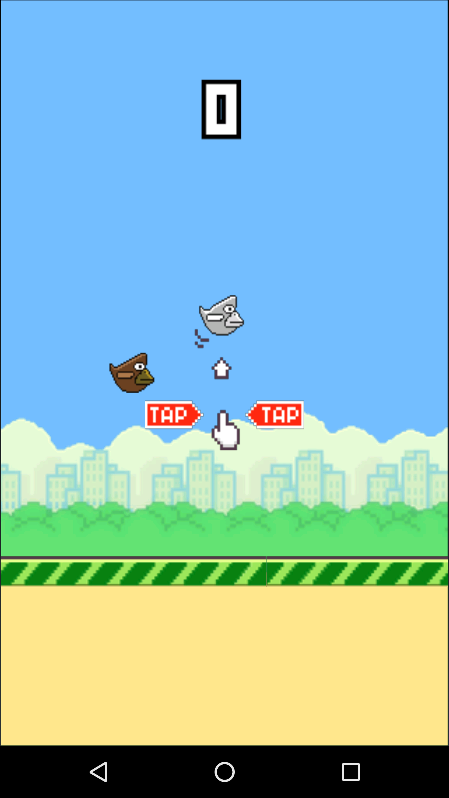

#Introduction
This is a Flappy Bird clone game running on mobile Android platform and is made using AndEngine. Maya Bird has similar gameplay with Flappy Bird. The only difference is instead of going through a gap between two facing pipes to score, you have the ability to eat two types of *flappy bird* that either adds or reduces your score. The yellow bird gives +1 to your score and the red bird gives -1 to your score.

The term *maya* refers to a folk taxon often used in the Philippines to refer to a variety of small, commonly observed passerine birds, including a number of sparrows, finches and munias. It was chosen as the type of bird to be used as the game's character design because it is a common bird in the Philippines and was previously known to be the country's national bird.

The game project was created on 2014 while the author was still in college and was presented under the DCSIS, USM (Department of Computer Science and Information Systems, University of Southern Mindanao) as part of a booth presentation including different student software projects in an annual event called PSITE-PSITS convention. Though the game was originally made for learning Android development, Game development and AndEngine library, it was later modified to cater project presentation needs for some events and project requirements.

#Development
The author decided to create the project with a single class containing only 1166 lines of code (including spaces) to show how easy and simple it is to create a game using the AndEngine library which is the same library used to create Flappy Bird on Android.

###Tools Used
- ~~Eclipse ADT~~ [Android Studio](https://developer.android.com/studio/index.html#win-bundle)
- [Android SDK](https://dl.google.com/dl/android/studio/install/2.1.3.0/android-studio-bundle-143.3101438-windows.exe)
- [AndEngine](https://github.com/nicolasgramlich/AndEngine)

#Screenshots

#Download
[Maya Bird - APK](https://www.dropbox.com/s/vag2oadrddqktym/MayaBird.apk?dl=0)
